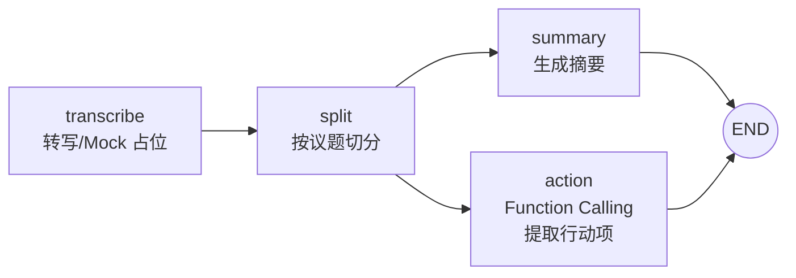

# Multi-Agent Meeting Assistant

基于 **DeepSeek（OpenAI 兼容接口）+ LangGraph + FastAPI** 的会议纪要生成服务：输入一段会议文字记录，自动完成「议题切分 → 摘要生成 / 行动项提取」，输出结构化的会议摘要和待办事项（内容、负责人、截止时间）。

> 说明：项目中的 "多智能体" 指由 LangGraph 编排的、职责单一的多个 LLM 角色节点（切分员、摘要员、行动项提取员），流程是一张
>
> **确定性的有向图（DAG）**
>
> ，并非可以自主规划、循环调用工具的自主式 Agent（Autonomous Agent）。这样设计是有意的：会议纪要是目标明确、输出结构固定的任务，确定性流程在稳定性和可测试性上优于让模型自由发挥。

## 功能


* **议题切分**：调用 LLM 将长会议记录按议题切成文本块，要求以 JSON 数组返回

* **会议摘要**：基于切分后的议题块生成结构化纯文本摘要，突出决策与结论

* **行动项提取**：基于会议全文，通过 **Function Calling（工具调用）** 提取待办事项，强制输出 `content / owner / deadline` 三字段

* **Mock 模式**：内置 `MockChatModel` 和样例会议记录，没有 API Key、不联网也能跑通全链路，便于本地调试与测试

* **HTTP 接口**：FastAPI 提供 `POST /meetings/process`，并自带 `/docs` Swagger 调试页

当前**不包含**真实语音识别（ASR）：转写节点是一个 Mock 占位，接口直接接收文本；接入 Whisper 或云厂商 ASR 即可替换该节点（见 "后续改进"）。

## 技术栈


| 用途     | 选型                                                                           |
| ------ | ---------------------------------------------------------------------------- |
| Web 框架 | FastAPI、Uvicorn                                                              |
| 流程编排   | LangGraph（`StateGraph` + `TypedDict` 状态）                                     |
| 大模型    | DeepSeek `deepseek-chat`，经 `langchain-openai` 的 `ChatOpenAI` 以 OpenAI 兼容方式接入 |
| 数据校验   | Pydantic v2（接口模型）、pydantic-settings（配置）                                      |
| 配置     | `.env` 环境变量 + `pydantic-settings` 统一加载                                       |

## 工作流




四个节点在一张 `StateGraph` 上顺序 / 并行执行：


1. `transcribe_node` —— ASR 占位节点。请求中传入了 `transcript` 则直接透传；未传则使用内置的样例会议记录。

2. `split_node` —— 把全文交给 LLM，按议题切成 JSON 数组，解析为 `segments`；解析失败时做容错降级，保证流程不中断。

3. `summary_node` —— 读取 `segments`（按议题组织的文本），生成会议摘要。

4. `action_node` —— 读取**会议全文** `full_text`（避免一个待办的责任人 / 截止时间在切分边界处被截断），绑定 `extract_action_items` 工具，以 Function Calling 方式拿到结构化行动项。

`split` 之后是一次 **fan-out（扇出）**：摘要与行动项两个分支互不依赖，由 LangGraph 调度在同一个执行步中并发运行，最后在 `END` 处汇合。两个分支写入的状态字段互不重叠（`summary` / `action_items`），因此不会产生状态写冲突。

所有节点共享一个 `MeetingState` 状态对象，每个节点只返回自己负责更新的字段，由 LangGraph 合并回状态（默认通道语义为 "后写覆盖"）。

## 目录结构


```
multi-agent-meeting-assistant/

├── app/

│   ├── main.py                # FastAPI 应用入口、健康检查

│   ├── api/

│   │   ├── routes.py          # POST /meetings/process 路由

│   │   └── schemas.py         # Pydantic 请求/响应模型

│   ├── core/

│   │   └── config.py          # 环境变量与全局配置（Settings 单例）

│   ├── graph/

│   │   ├── state.py           # MeetingState / ActionItem（TypedDict）

│   │   ├── llm.py             # get\_llm 工厂 + 离线 MockChatModel

│   │   ├── nodes.py           # 四个图节点、Prompt、工具 Schema、解析函数

│   │   └── workflow.py        # StateGraph 的搭建、编译与单例

│   └── services/              # 预留：ASR、持久化等外部服务封装（暂为空包）

├── .env.example

├── requirements.txt

└── README.md
```

## 快速开始


1. 安装依赖（Python 3.10+）：


```
pip install -r requirements.txt
```


1. 配置环境变量。复制 `.env.example` 为 `.env`：


```
\# 不填真实 Key、纯离线调试时保持 USE\_MOCK\_LLM=true 即可

DEEPSEEK\_API\_KEY=sk-xxx

USE\_MOCK\_LLM=true

\# 接入真实 API 时再补充以下项（config.py 中已有默认值）：

\# DEEPSEEK\_BASE\_URL=https://api.deepseek.com

\# DEEPSEEK\_MODEL=deepseek-chat

\# TEMPERATURE=0.3
```


1. 启动服务（在项目根目录执行）：


```
uvicorn app.main:app --reload
```


1. 打开 Swagger 调试页：[http://localhost:8000/docs](http://localhost:8000/docs)，或用命令行调用：


```
\# 不传 transcript：使用内置样例会议记录

curl -X POST http://localhost:8000/meetings/process \\

&#x20;    -H "Content-Type: application/json" \\

&#x20;    -d '{"transcript": ""}'

\# 传入自己的会议记录

curl -X POST http://localhost:8000/meetings/process \\

&#x20;    -H "Content-Type: application/json" \\

&#x20;    -d '{"transcript": "张三负责本周五前给出方案，李四下周三前完成评审……"}'
```

健康检查：`GET /health` → `{"status": "ok"}`。

## API

### `POST /meetings/process`

请求体：


| 字段           | 类型     | 说明                     |
| ------------ | ------ | ---------------------- |
| `transcript` | string | 会议文字记录，为空时使用内置 Mock 数据 |

响应体：


| 字段             | 类型        | 说明                                                     |
| -------------- | --------- | ------------------------------------------------------ |
| `summary`      | string    | 会议摘要                                                   |
| `action_items` | array     | 待办事项列表，元素含 `content`（内容）、`owner`（负责人）、`deadline`（截止时间） |
| `segments`     | string\[] | 按议题切分后的文本块                                             |

## 关键设计


* **状态驱动的图编排**：以 `TypedDict` 定义全局状态，节点是纯函数 `state -> 部分字段更新`，不互相直接调用，新增 / 替换节点只需要改图的连边，业务代码不动。

* **Function Calling 约束结构化输出**：行动项提取不依赖 "请返回 JSON" 式的提示词，而是声明工具的 JSON Schema 并强制模型走工具调用，LangChain 直接返回解析好的 `args` 字典；同时保留 "从正文 JSON 解析" 的兜底路径。

* **面向失败的解析**：LLM 输出不稳定是常态。切分结果先 `json.loads`，失败则截取首个 `[` 到末个 `]` 再试（兼容 \`\`\`json 代码块包裹），再失败就把整段文本作为单个议题块，保证摘要节点永远有输入。

* **Mock 与真实实现同接口**：`MockChatModel` 用鸭子类型实现了 `invoke` / `bind_tools`，并按提示词关键词返回预制的 `AIMessage`（含模拟的 `tool_calls`），`get_llm()` 工厂按配置切换，节点代码对环境无感知，CI 和离线演示都不花钱、不联网。

* **配置与密钥隔离**：API Key 只从 `.env` / 环境变量读取，`.env` 已在 `.gitignore` 中。